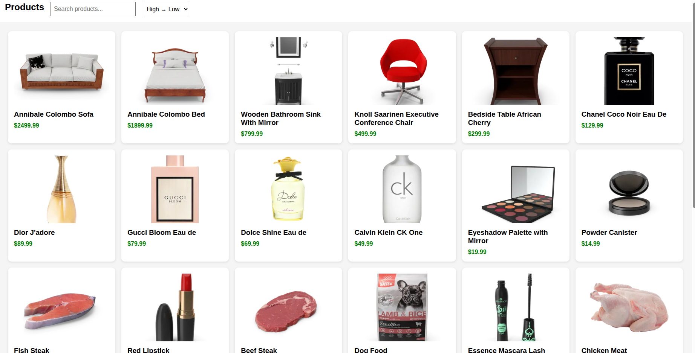

# 🛒 Day 5 – Capstone UI + JS Project  
## Mini E-commerce Product Listing Page

This project combines **HTML + CSS + JavaScript** to build a working, responsive product listing page.  
Products are fetched from an API and shown using cards with search and sorting functionality.

---

## 🚀 Features

### ✔ Fetch API  
Data loaded from:  
https://dummyjson.com/products

### ✔ Product Cards  
Each card displays:
- Product image  
- Title  
- Price  

### ✔ Search Bar  
Live filter products by title.

### ✔ Sorting  
Sort by:
- Low → High price  
- High → Low price  

### ✔ Responsive Layout  
Uses CSS Grid to automatically resize for mobile, tablet, and desktop.

---

## 📁 Folder Structure

week2-frontend/
│
├── index.html
├── products.html
├── style.css
└── script.js

---

## 📝 What I Learned

### ⭐ 1. HTML Structure  
- How to create a navbar, input fields, and containers.  
- How to link CSS & JS files.  

### ⭐ 2. CSS (Flexbox + Grid)  
- Flexbox for navbar layout.  
- Grid for product cards.  
- Making UI responsive with `auto-fit` + `minmax()`.

### ⭐ 3. JavaScript DOM Manipulation  
- `document.getElementById()`  
- Updating the page using `innerHTML`  
- Handling events like `input` and `change`.

### ⭐ 4. Fetch API  
- How to request data from a URL.  
- Using `async/await`.  
- Reading JSON response.

### ⭐ 5. Search Logic  
Filtering products using:
```js
product.title.toLowerCase().includes(query)
```
### ⭐ 6. Sorting Logic
Sorting numbers using:


```
products.sort((a, b) => a.price - b.price);
```
### ⭐ 7. Clean UI Thinking
Breaking UI into components (navbar, cards).

Planning layout before coding.

🧩 How to Run
```
> Open folder in VS Code

> Install Live Server extension

> Right-click products.html → "Open with Live Server"

> Products will load dynamically
```
## 📸 Screenshots




✔ Deliverables
```
> index.html

> products.html

> style.css

> script.js

> This README file
```
# 👨‍💻 Author
## Om Ji Dubey